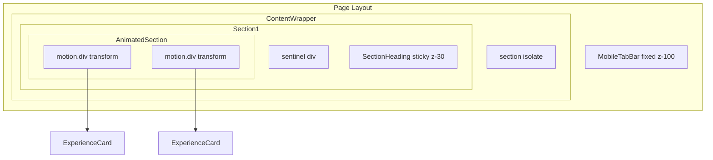

# Sticky Elements Stacking Context Issue (Safari)

On mobile Safari (iOS), sticky section headings and the fixed bottom tab bar fail to obscure scrolling content. As you scroll, content appears in front of these elements instead of behind them.

---

## Observed Behavior

### Sticky section headings (e.g. EXPERIENCE, PROJECTS)

As you scroll, content (e.g. "Forward Deployed Engineer · Everise") scrolls up toward the top of the viewport. When it reaches the area where the sticky heading (e.g. "EXPERIENCE") is fixed, the content **appears in front of** the heading instead of scrolling behind it. The heading should obscure the content as it passes; instead, the content is visible in the same visual space as the heading.

### Fixed bottom tab bar

As you scroll, content (e.g. "virkhanna.net" from the footer) becomes visible in the area that should be covered by the tab bar. Content appears **below/through** the bar instead of being hidden by it.

---

## Root Cause

Stacking context isolation. Framer Motion applies `transform` and `opacity` to animated elements, which creates new stacking contexts. Z-index only applies within the same stacking context. The sticky heading and fixed tab bar end up in different stacking contexts than the animated content, so their z-index values are never compared. Safari (especially iOS) handles these stacking contexts differently than Chrome, making the issue more visible.

---

## Platform

Safari (especially iOS Safari). May not reproduce in Chrome or other browsers.

---

## Affected Codebase Files

| File | Role in the problem |
|------|---------------------|
| [components/ui/SectionHeading.tsx](../components/ui/SectionHeading.tsx) | Sticky heading (`sticky top-0 z-30`, `bg-navy/75 backdrop-blur`) on mobile. Uses a sentinel + IntersectionObserver for "stuck" state. |
| [components/effects/AnimatedSection.tsx](../components/effects/AnimatedSection.tsx) | `motion.div` with `relative z-0`; applies opacity animation. `AnimatedChild` uses `motion.div` with `opacity`, `y`, `scale` variants — these create stacking contexts via transform/opacity. |
| [components/layout/MobileTabBar.tsx](../components/layout/MobileTabBar.tsx) | Fixed bottom nav (`fixed bottom-0 z-[100]`, `bg-navy/95 backdrop-blur-sm`). Sibling of main content in layout. |
| [app/page.tsx](../app/page.tsx) | Layout: `MobileTabBar` and content wrapper (`relative z-0 min-h-screen`) are siblings. Main content (sections) lives inside the wrapper. |
| [app/globals.css](../app/globals.css) | `body::before` has `z-index: 9999` (grain overlay). `.pb-mobile-tabbar` adds bottom padding for the tab bar. |
| [components/sections/About.tsx](../components/sections/About.tsx) | Uses `SectionHeading` + `AnimatedSection`/`AnimatedChild`. Section has `relative isolate`. |
| [components/sections/Experience.tsx](../components/sections/Experience.tsx) | Same pattern; contains `ExperienceCard` inside `AnimatedChild`. |
| [components/sections/Projects.tsx](../components/sections/Projects.tsx) | Same pattern; contains `ProjectCard` inside `AnimatedChild`. |
| [components/sections/Skills.tsx](../components/sections/Skills.tsx) | Same pattern. |
| [components/sections/Blog.tsx](../components/sections/Blog.tsx) | Uses `SectionHeading` but no `AnimatedSection` for the grid; may be less affected. |
| [components/cards/ExperienceCard.tsx](../components/cards/ExperienceCard.tsx) | Rendered inside `AnimatedChild`; inherits Framer Motion transform/opacity. |
| [components/cards/ProjectCard.tsx](../components/cards/ProjectCard.tsx) | Same. |

---

## DOM / Stacking Flow

---

## Attempted Fixes

The following have been tried; the issue persists on Safari:

1. **`isolate` on sections** — Added `relative isolate` to each section (`About`, `Experience`, `Projects`, `Skills`, `Blog`) to create a common stacking context for heading + content.
2. **Z-index bumps** — Raised sticky heading from `z-20` to `z-30`, and MobileTabBar from `z-50` to `z-[100]`.
3. **Content wrapper `z-0`** — Added `z-0` to the main content wrapper so it forms an explicit stacking context, with the tab bar as a sibling at `z-[100]`.
